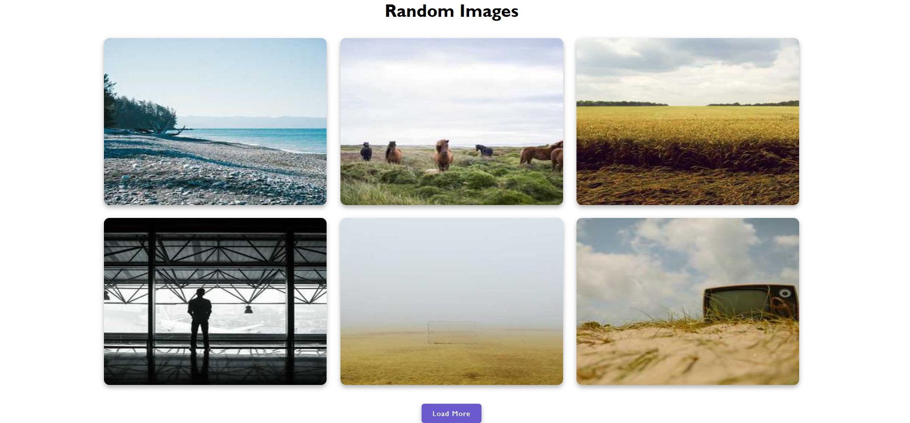

# 📸 Random Images Web Project

This is a simple web-based project that displays random images using HTML, CSS, and JavaScript. It is deployed using GitHub Pages.

## 🌐 Live Demo
🔗 [View the website](https://kumar-veerendra.github.io/random-images/)

## 📁 Features

- Displays random images from a predefined collection
- Clean and responsive design
- Deployed using GitHub Pages
- Easy to extend with more images or API support

## 🚀 Technologies Used

- HTML5
- CSS3
- JavaScript (Vanilla JS)

## 🖼️ Screenshot



## 📦 How to Use

1. Clone the repository:
   ```bash
   git clone https://github.com/kumar-veerendra/random-images.git
   ```
2. Open `index.html` in your browser.

OR

Just visit the [Live Demo](https://kumar-veerendra.github.io/random-images/) link.

## 🛠️ Future Improvements

- Integrate with an API (e.g., Unsplash, Picsum)
- Add category filters
- Dark/Light mode toggle
- Image download button

## 📄 License

This project is open source and available under the [MIT License](LICENSE).

---
